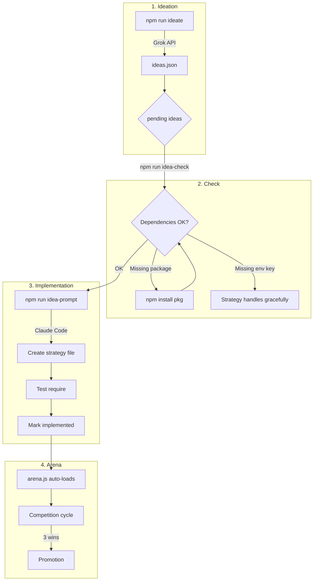

# Polymarket Whale Trader

Automated trading bot for Polymarket that combines whale tracking with technical analysis. Features a strategy arena for competitive evaluation and an AI-powered ideation system.

## Architecture

```
src/
├── index.js              # Entry point (trade, scan, compete, arena)
├── trader.js             # Main trading logic
├── arena.js              # Strategy competition system
├── signals.js            # Signal aggregation
├── strategies/           # Trading strategies (auto-loaded)
│   ├── baseline.js       # Reference strategy
│   ├── creative.js       # Multi-variant strategies
│   ├── insider-tracker.js
│   ├── cross-exchange-arb.js
│   ├── sentiment-divergence.js
│   └── TEMPLATE.js       # Template for new strategies
├── ideation/
│   ├── agent.js          # Grok-powered idea generator
│   ├── check.js          # Dependency checker & prompt generator
│   └── SKILL.md          # Claude Code implementation guide
└── paper-trader.js       # Paper trading & performance tracking

data/
├── ideas.json            # Generated strategy ideas
├── dependencies.json     # Data source registry
├── arena-state.json      # Competition state
└── paper-trades.json     # Trade history
```

## Strategy Arena

The arena runs all strategies in competition:
- **Champion** trades with real funds
- **Challengers** trade on paper
- If a challenger beats the champion 3 consecutive times, it gets promoted

```bash
npm run compete                    # Run competition cycle
npm run compete <market-slug>      # Specific market
npm run arena                      # Show arena status
```

## Strategy Ideation Pipeline

AI-powered strategy generation and auto-implementation.

### Workflow



### Commands

```bash
# Generate new ideas via Grok
npm run ideate

# List pending ideas
npm run ideas

# Check next idea to implement (with deps)
npm run idea-check

# Get full Claude Code prompt
npm run idea-prompt

# Check dependency registry
npm run idea-deps
```

### Idea Lifecycle

```
pending → implementing → implemented
                      → blocked (missing deps)
                      → failed (implementation error)
```

### Auto-Implementation Flow

1. **Cron/Manual** : `npm run idea-check` détecte une idée `pending`
2. **Spawn Claude Code** avec `npm run idea-prompt` :
   - Template de stratégie (`TEMPLATE.js`)
   - Idée JSON (entry/exit/risk rules)
   - Instructions (`SKILL.md`)
3. **Claude Code** implémente, teste, commit
4. **Mark** : `node src/ideation/agent.js mark-implemented <id>`
5. **Arena** détecte la nouvelle stratégie au prochain cycle

New strategies are automatically loaded by the arena on next cycle.

## Baseline Strategy

Multi-signal approach with weighted scoring:

| Signal | Weight | Description |
|--------|--------|-------------|
| **Whale Consensus** | 50% | Tracks 7 top traders, weighted by portfolio size and win rate |
| **Momentum** | 20% | Multi-timeframe momentum (5m, 15m, 1h, 4h) |
| **Technicals** | 15% | RSI and MA crossovers |
| **Sentiment** | 15% | Fear & Greed Index (contrarian) |

### Position Sizing

Uses Kelly Criterion with safety factor:
- Kelly fraction: 25% (conservative)
- Max bet: 10% of bankroll
- Hard cap: $50 per trade

## Usage

```bash
# Install dependencies
npm install

# Scan signals only (no trading)
npm run scan

# Run trading cycle
npm run trade

# Run strategy competition
npm run compete

# Show arena status
npm run arena

# Show paper trading performance
npm run status
```

## Data Sources

Available sources for strategies (see `data/dependencies.json`):

| Source | Status | Description |
|--------|--------|-------------|
| `polymarket_sdk` | Installed | CLOB API, orderbook, positions |
| `gamma_api` | Installed | Events, markets, historical odds |
| `whale_positions` | Installed | 7 tracked whales |
| `fear_greed` | Installed | Crypto Fear & Greed Index |
| `coingecko` | Installed | Crypto prices |
| `binance` | Installed | BTC price data |
| `x_sentiment` | Requires key | Twitter/X sentiment |
| `polygon_scan` | Requires key | On-chain activity |
| `cross_exchange` | Requires key | Kalshi, Limitless odds |

## Cron Jobs

Recommended crontab for automated operation:

```crontab
# Trading cycle - every 5 minutes during market hours
*/5 * * * * cd /path/to/polymarket-whale-trader && npm run compete >> logs/compete.log 2>&1

# Generate new strategy ideas - daily at 8am
0 8 * * * cd /path/to/polymarket-whale-trader && npm run ideate >> logs/ideate.log 2>&1

# Check for ideas to implement - every 2 hours
0 */2 * * * cd /path/to/polymarket-whale-trader && npm run idea-check >> logs/idea-check.log 2>&1
```

### Cron Overview

| Job | Schedule | Command | Purpose |
|-----|----------|---------|---------|
| **Trading** | `*/5 * * * *` | `npm run compete` | Run strategy competition cycle |
| **Ideation** | `0 8 * * *` | `npm run ideate` | Generate new strategy ideas via Grok |
| **Implementation Check** | `0 */2 * * *` | `npm run idea-check` | Detect pending ideas ready for implementation |

### Setup

```bash
# Create logs directory
mkdir -p logs

# Edit crontab
crontab -e

# View logs
tail -f logs/compete.log
tail -f logs/ideate.log
```

### Manual Triggers

```bash
# Force a competition cycle now
npm run compete

# Generate ideas now
npm run ideate

# Check and implement next idea
npm run idea-prompt | pbcopy  # Copy prompt to clipboard for Claude Code
```

## Configuration

Edit `src/config.js` to adjust:
- Signal weights
- Position sizing parameters
- Minimum edge threshold
- Whale list and trust weights

## Requirements

- Node.js 18+
- Polymarket wallet with USDC.e on Polygon
- Private key in `~/.config/clawd/secrets.env`
- `XAI_API_KEY` for ideation (Grok)

## Approvals Required

Before trading, approve USDC.e for these contracts:
- CTF Exchange: `0x4bFb41d5B3570DeFd03C39a9A4D8dE6Bd8B8982E`
- Neg Risk CTF: `0xC5d563A36AE78145C45a50134d48A1215220f80a`
- Neg Risk Adapter: `0xd91E80cF2E7be2e162c6513ceD06f1dD0dA35296`

And setApprovalForAll on CT contract `0x4D97DCd97eC945f40cF65F87097ACe5EA0476045`.

## License

MIT
